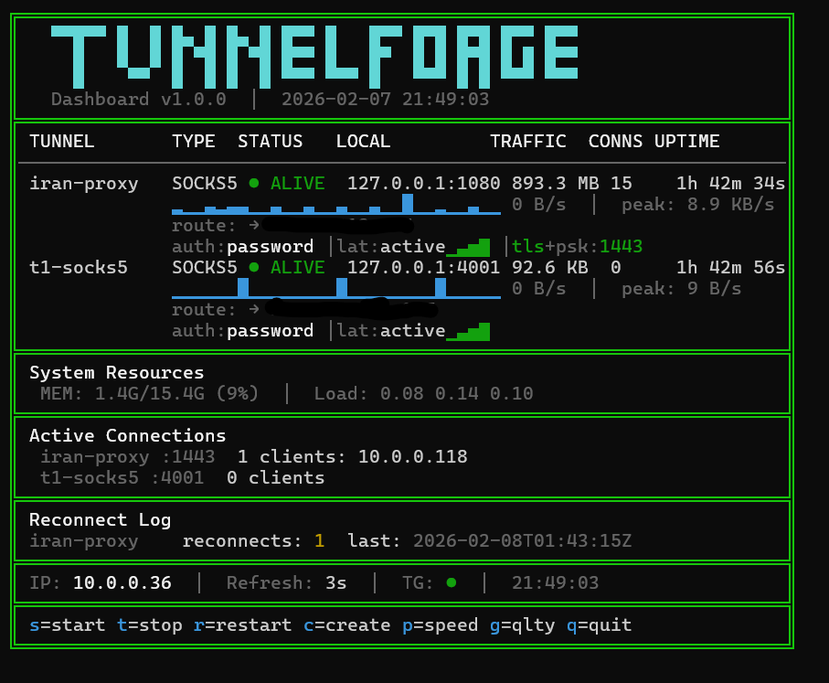

<p align="center">
  <pre align="center">
  ▀▀█▀▀ █  █ █▄ █ █▄ █ █▀▀ █   █▀▀ █▀█ █▀█ █▀▀ █▀▀
    █   █  █ █ ▀█ █ ▀█ █▀▀ █   █▀  █ █ █▀█ █ █ █▀▀
    █    ▀▀  █  █ █  █ ▀▀▀ ▀▀▀ █   ▀▀▀ █ █ ▀▀▀ ▀▀▀
  </pre>
</p>

<h3 align="center">The Ultimate Single-File SSH Tunnel Manager</h3>

<p align="center">
  <a href="#license--author"></a>
  
  
  
  
</p>

<p align="center">
  <b>One script. Every tunnel type. Full TUI. Live dashboard.</b><br>
  <sub>SOCKS5 &bull; Local Forward &bull; Remote Forward &bull; Jump Hosts &bull; TLS Obfuscation &bull; Telegram Bot &bull; Kill Switch &bull; DNS Leak Protection</sub>
</p>

---

## Quick Start

**One-line install:**
```bash
curl -fsSL https://raw.githubusercontent.com/SamNet-dev/tunnelforge/main/tunnelforge.sh -o tunnelforge.sh && sudo bash tunnelforge.sh install
```

**Or clone the repo:**
```bash
git clone https://github.com/SamNet-dev/tunnelforge.git
cd tunnelforge
sudo bash tunnelforge.sh install
```

**Launch the interactive menu:**
```bash
tunnelforge menu
```

**Or use CLI directly:**
```bash
tunnelforge create                  # Create your first tunnel
tunnelforge start my-tunnel         # Start it
tunnelforge dashboard               # Watch it live
```

<p align="center">
  
  <br>
  <sub>Interactive TUI — manage tunnels, security, services, and more from a single menu</sub>
</p>

---

## Why TunnelForge?

Most SSH tunnel tools are either too simple (just a wrapper around `ssh -D`) or too complex (requiring Docker, Go, Python, or a dozen config files). TunnelForge is different:

| | TunnelForge | Others |
|---|---|---|
| **Installation** | Single bash file, zero dependencies | Python/Go/Node.js + package managers |
| **Interface** | Full TUI menu + CLI + live dashboard | CLI-only or web UI requiring a browser |
| **Security** | DNS leak protection, kill switch, audit scoring | Basic SSH only |
| **Obfuscation** | TLS wrapping + PSK to bypass DPI/censorship | Not available |
| **Monitoring** | Real-time sparkline bandwidth graphs | Log files |
| **Notifications** | Telegram bot with remote commands | None |
| **Persistence** | Auto-generated systemd services | Manual configuration |
| **Education** | Built-in Learn menu with diagrams | External docs |
| **Client Sharing** | One-click generated scripts (Linux + Windows) | Manual setup |

**TunnelForge is the most complete SSH tunnel manager available as a single file.**

---

<details>
<summary><h2>Features Overview</h2></summary>

### Tunnel Management
- **SOCKS5 Dynamic Proxy** (`-D`) — Route all traffic through SSH server
- **Local Port Forwarding** (`-L`) — Access remote services locally
- **Remote/Reverse Forwarding** (`-R`) — Expose local services remotely
- **Jump Host / Multi-Hop** (`-J`) — Chain through bastion servers
- **AutoSSH Integration** — Automatic reconnection on drop
- **ControlMaster Multiplexing** — Reuse SSH connections
- **Multi-tunnel Support** — Run dozens of tunnels simultaneously

### Security
- **DNS Leak Protection** — Rewrites resolv.conf + locks with `chattr`
- **Kill Switch** — iptables rules block all traffic if tunnel drops (IPv4 + IPv6)
- **6-Point Security Audit** — Scored assessment of your tunnel security posture
- **SSH Key Generation** — Create ed25519, RSA, or ECDSA keys
- **SSH Key Deployment** — One-command deploy to remote servers
- **Host Fingerprint Verification** — Verify server identity before connecting
- **Server Hardening** — Automated sshd, firewall, fail2ban, sysctl configuration

### Monitoring & Dashboard
- **Live TUI Dashboard** — Real-time tunnel status with auto-refresh
- **Sparkline Bandwidth Graphs** — ASCII sparklines (▁▂▃▄▅▆▇█) for RX/TX
- **Traffic Counters** — Total bytes transferred per tunnel
- **Uptime Tracking** — Per-tunnel uptime display
- **Connection Quality** — Latency measurement with color-coded indicators
- **Speed Test** — Built-in download speed test through tunnel
- **Pagination** — Navigate across pages when running many tunnels

### Telegram Bot
- **Real-time Alerts** — Start, stop, fail, reconnect notifications
- **Remote Commands** — `/tf_status`, `/tf_list`, `/tf_ip`, `/tf_config` and more
- **Periodic Reports** — Scheduled status reports to your phone
- **Client Sharing** — Send connection scripts + PSK via Telegram
- **SOCKS5 Routing** — Bot works through your tunnel when Telegram is blocked

### TLS Obfuscation (Anti-Censorship)
- **Outbound TLS Wrapping** — SSH traffic disguised as HTTPS via stunnel
- **Inbound PSK Protection** — SOCKS5 listener secured with Pre-Shared Key
- **Client Script Generator** — Auto-generate connect scripts for Linux + Windows
- **One-Click Server Setup** — Automated stunnel installation and configuration
- **DPI Bypass** — Traffic appears as normal HTTPS on port 443

### System Integration
- **Systemd Service Generator** — Auto-create hardened unit files
- **Backup & Restore** — Full configuration backup with rotation
- **Server Setup Wizard** — Harden a fresh server for receiving tunnels
- **Profile Management** — Create, edit, delete, import tunnel profiles
- **Log Management** — Per-tunnel logs with rotation
- **Clean Uninstall** — Complete removal of all files, services, and configs

### Built-in Education
- **Learn Menu** — 9 interactive lessons on SSH tunneling concepts
- **Scenario Examples** — Step-by-step real-world use cases with diagrams
- **ASCII Diagrams** — Visual traffic flow for every tunnel type

</details>

---

<details>
<summary><h2>Tunnel Types Explained</h2></summary>

### SOCKS5 Dynamic Proxy (`-D`)

Route **all** your TCP traffic through a remote SSH server. Your traffic appears to originate from the server's IP address.

```
┌──────────┐          ┌──────────┐          ┌──────────┐
│  Client   │  SSH     │  SSH     │  Direct  │  Target  │
│           ├─────────►│  Server  ├─────────►│  Website │
│ :1080     │ Encrypted│          │          │          │
└──────────┘          └──────────┘          └──────────┘
     ▲
  Browser
  SOCKS5
```

**Use cases:** Private browsing, bypass geo-restrictions, hide your IP, route traffic through a different country.

```bash
tunnelforge create    # Select "SOCKS5 Proxy" → set port 1080
tunnelforge start my-proxy
# Configure browser: SOCKS5 proxy → 127.0.0.1:1080
curl --socks5-hostname 127.0.0.1:1080 https://ifconfig.me
```

---

### Local Port Forwarding (`-L`)

Access a **remote service** as if it were running locally. Map a local port to a service behind the SSH server.

```
┌──────────┐          ┌──────────┐          ┌──────────┐
│  Client   │  SSH     │  SSH     │  Local   │  MySQL   │
│           ├─────────►│  Server  ├─────────►│  :3306   │
│ :3306     │ Encrypted│          │ Network  │          │
└──────────┘          └──────────┘          └──────────┘
     ▲
  mysql -h
  127.0.0.1
```

**Use cases:** Access remote databases, internal web apps, admin panels behind firewalls.

```bash
tunnelforge create    # Select "Local Forward" → local 3306 → remote db:3306
tunnelforge start db-tunnel
mysql -h 127.0.0.1 -P 3306 -u admin -p
```

---

### Remote/Reverse Forwarding (`-R`)

Expose a **local service** to the outside world through a remote SSH server. Users connect to the server and reach your local machine.

```
┌──────────┐          ┌──────────┐          ┌──────────┐
│  Local    │  SSH     │  SSH     │  Public  │  Users   │
│  Dev App  │◄────────►│  Server  │◄─────────│  on Web  │
│ :3000     │ Encrypted│ :9090    │          │          │
└──────────┘          └──────────┘          └──────────┘
```

**Use cases:** Webhook development, share local app for testing, NAT traversal, demo to clients.

```bash
tunnelforge create    # Select "Remote Forward" → remote 9090 ← local 3000
tunnelforge start dev-share
# Others access: http://your-server:9090
```

---

### Jump Hosts / Multi-Hop (`-J`)

Reach servers behind **multiple layers** of firewalls by chaining through intermediate SSH servers.

```
┌──────────┐     ┌──────────┐     ┌──────────┐     ┌──────────┐
│  Client   │────►│  Bastion  │────►│  Jump 2   │────►│  Target  │
│           │ SSH │  Server   │ SSH │  Server   │ SSH │  Server  │
└──────────┘     └──────────┘     └──────────┘     └──────────┘
```

**Use cases:** Corporate networks, multi-tier architectures, isolated environments, high-security zones.

```bash
tunnelforge create    # Select "Jump Host" → jumps: admin@bastion:22
tunnelforge start corp-tunnel
```

</details>

---

<details>
<summary><h2>Installation</h2></summary>

### Requirements

| Requirement | Details |
|---|---|
| **OS** | Linux (Ubuntu, Debian, CentOS, Fedora, Arch, Alpine) |
| **Bash** | 4.3 or higher |
| **Privileges** | Root access for installation |
| **SSH** | OpenSSH client (pre-installed on most systems) |
| **Optional** | `autossh` (auto-reconnect), `stunnel` (TLS obfuscation), `sshpass` (password auth) |

### Install

```bash
# Option 1: Git clone
git clone https://github.com/SamNet-dev/tunnelforge.git
cd tunnelforge
sudo bash tunnelforge.sh install

# Option 2: Direct download
curl -fsSL https://raw.githubusercontent.com/SamNet-dev/tunnelforge/main/tunnelforge.sh -o tunnelforge.sh
sudo bash tunnelforge.sh install
```

### Verify Installation

```bash
tunnelforge version
# TunnelForge v1.0.0
```

### Directory Structure

After installation, TunnelForge creates:

```
/opt/tunnelforge/
├── tunnelforge.sh              # Main script
├── config/
│   └── tunnelforge.conf        # Global configuration
├── profiles/
│   └── *.conf                  # Tunnel profiles
├── pids/                       # Running tunnel PIDs
├── logs/                       # Per-tunnel log files
├── backups/                    # Configuration backups
├── data/
│   ├── bandwidth/              # Bandwidth history (sparklines)
│   └── reconnects/             # Reconnect statistics
└── sockets/                    # SSH ControlMaster sockets
```

A symlink is created at `/usr/local/bin/tunnelforge` for global access.

</details>

---

<details>
<summary><h2>Quick Examples</h2></summary>

### Browse Privately via SOCKS5

```bash
tunnelforge create
# → Name: private-proxy
# → Type: SOCKS5
# → Server: user@myserver.com
# → Port: 1080

tunnelforge start private-proxy

# Test it
curl --socks5-hostname 127.0.0.1:1080 https://ifconfig.me

# Configure Firefox: Settings → Network → Manual Proxy → SOCKS5: 127.0.0.1:1080
```

### Access a Remote Database

```bash
tunnelforge create
# → Name: prod-db
# → Type: Local Forward
# → Server: admin@db-server.internal
# → Local port: 3306 → Remote: localhost:3306

tunnelforge start prod-db
mysql -h 127.0.0.1 -P 3306 -u dbuser -p
```

### Share Your Local Dev Server

```bash
tunnelforge create
# → Name: demo-share
# → Type: Remote Forward
# → Server: user@public-vps.com
# → Remote port: 8080 ← Local: localhost:3000

tunnelforge start demo-share
# Share with anyone: http://public-vps.com:8080
```

### Chain Through Jump Hosts

```bash
tunnelforge create
# → Name: corp-access
# → Type: Jump Host
# → Jump: admin@bastion.corp.com:22
# → Target: user@internal-server:22
# → SOCKS5 port: 1080

tunnelforge start corp-access
```

### Bypass Censorship with TLS Obfuscation

```bash
# First, set up stunnel on your VPS
tunnelforge obfs-setup my-tunnel

# Now SSH traffic is wrapped in TLS on port 443
# DPI sees: normal HTTPS traffic
# Reality: SSH tunnel inside TLS
tunnelforge start my-tunnel

# Share with others
tunnelforge client-script my-tunnel    # Generates connect scripts
tunnelforge telegram share my-tunnel   # Send scripts via Telegram
```

</details>

---

<details>
<summary><h2>CLI Reference</h2></summary>

### Tunnel Commands

| Command | Description |
|---|---|
| `tunnelforge start <name>` | Start a tunnel |
| `tunnelforge stop <name>` | Stop a tunnel |
| `tunnelforge restart <name>` | Restart a tunnel |
| `tunnelforge start-all` | Start all autostart tunnels |
| `tunnelforge stop-all` | Stop all running tunnels |
| `tunnelforge status` | Show all tunnel statuses |
| `tunnelforge dashboard` | Launch live TUI dashboard |
| `tunnelforge logs [name]` | Tail tunnel logs |

### Profile Commands

| Command | Description |
|---|---|
| `tunnelforge create` | Create a new tunnel profile (wizard) |
| `tunnelforge list` | List all profiles |
| `tunnelforge delete <name>` | Delete a profile |

### Security Commands

| Command | Description |
|---|---|
| `tunnelforge audit` | Run 6-point security audit |
| `tunnelforge key-gen [type]` | Generate SSH key (ed25519/rsa/ecdsa) |
| `tunnelforge key-deploy <name>` | Deploy SSH key to server |
| `tunnelforge fingerprint <host> [port]` | Verify SSH host fingerprint |

### Telegram Commands

| Command | Description |
|---|---|
| `tunnelforge telegram setup` | Configure Telegram bot |
| `tunnelforge telegram test` | Send test notification |
| `tunnelforge telegram status` | Show notification config |
| `tunnelforge telegram send <msg>` | Send a message |
| `tunnelforge telegram report` | Send status report |
| `tunnelforge telegram share [name]` | Share client scripts via Telegram |

### Service Commands

| Command | Description |
|---|---|
| `tunnelforge service <name>` | Generate systemd service |
| `tunnelforge service <name> enable` | Enable and start service |
| `tunnelforge service <name> disable` | Disable and stop service |
| `tunnelforge service <name> status` | Show service status |
| `tunnelforge service <name> remove` | Remove service file |

### System Commands

| Command | Description |
|---|---|
| `tunnelforge menu` | Launch interactive TUI |
| `tunnelforge install` | Install TunnelForge |
| `tunnelforge server-setup` | Harden server for tunnels |
| `tunnelforge obfs-setup <name>` | Set up TLS obfuscation |
| `tunnelforge client-config <name>` | Show client connection config |
| `tunnelforge client-script <name>` | Generate client scripts |
| `tunnelforge backup` | Backup all configs |
| `tunnelforge restore [file]` | Restore from backup |
| `tunnelforge uninstall` | Remove everything |
| `tunnelforge version` | Show version |
| `tunnelforge help` | Show help |

</details>

---

<details>
<summary><h2>Interactive TUI Menu</h2></summary>

Launch with `tunnelforge menu` or just `tunnelforge` (no arguments):

```
╔══════════════════════════════════════════════════════════════╗
║              TunnelForge — Main Menu                         ║
╚══════════════════════════════════════════════════════════════╝

  ── Tunnels ──
    1) Create new tunnel            Setup wizard
    2) Start a tunnel               Launch SSH tunnel
    3) Stop a tunnel                Terminate tunnel
    4) Start All tunnels            Launch autostart tunnels
    5) Stop All tunnels             Terminate all

  ── Monitoring ──
    6) Status                       Show tunnel statuses
    7) Dashboard                    Live TUI dashboard

  ── Management ──
    8) Profiles                     Manage tunnel profiles
    9) Settings                     Configure defaults
    s) Services                     Systemd service manager
    b) Backup / Restore             Manage backups

  ── Security ──
    x) Security Audit               Check security posture
    k) SSH Key Management            Generate & deploy keys
    f) Fingerprint Check             Verify host fingerprints

  ── Extras ──
    t) Telegram                     Notification settings
    c) Client Configs               TLS+PSK connection info
    e) Examples                     Real-world scenarios
    l) Learn                        SSH tunnel concepts
    a) About                        Version & info

    u) Uninstall
    q) Quit

  Select:
```

Navigate by pressing a single key. No Enter needed. Every menu is keyboard-driven.

</details>

---

<details>
<summary><h2>Live Dashboard</h2></summary>

Launch with `tunnelforge dashboard` or press `7` in the main menu:

<p align="center">
  
  <br>
  <sub>Live dashboard with sparkline bandwidth graphs, active connections, reconnect log, and system resources</sub>
</p>

```
╔══════════════════════════════════════════════════════════════╗
║              TunnelForge Dashboard v1.0.0                    ║
║              Page 1/2  │  2026-02-07 14:32:15                ║
╚══════════════════════════════════════════════════════════════╝

  NAME              TYPE     STATUS     LOCAL             UPTIME
  ────────────────────────────────────────────────────────────
  iran-proxy        SOCKS5   ● ALIVE    127.0.0.1:1080    2h 8m
    RX ▁▂▃▅▇█▇▅▃▂  412.3 MB    TX ▁▁▂▃▅▇▅▃  82.1 MB

  t1-socks5         SOCKS5   ● ALIVE    127.0.0.1:4001    2h 9m
    RX ▁▁▁▂▂▃▂▁▁▁  96.7 KB     TX ▁▁▁▁▂▂▁▁  12.3 KB

  db-tunnel         LOCAL    ■ STOPPED  127.0.0.1:3306       —

  dev-share         REMOTE   ● ALIVE    0.0.0.0:9090      45m
    RX ▁▂▂▃▃▂▁▁▁▁  1.2 MB      TX ▁▁▁▂▃▅▃▂  890 KB

  ── Active Connections ──
  iran-proxy       : 3 connections
  t1-socks5        : 1 connection

  ── Recent Log ──
  14:32:10 [info] Tunnel 'iran-proxy' reconnected (AutoSSH)
  14:30:05 [info] Speed test: 12.4 Mbps via iran-proxy

  s=start t=stop r=restart c=create p=speed g=qlty q=quit [</>]
```

### Dashboard Keyboard Controls

| Key | Action |
|---|---|
| `s` | Start a tunnel |
| `t` | Stop a tunnel |
| `r` | Restart all running tunnels |
| `c` | Create a new profile |
| `p` | Run speed test |
| `g` | Check connection quality |
| `[` / `]` | Previous / next page |
| `q` | Exit dashboard |

### What It Shows
- **Status** — Live running/stopped state per tunnel
- **Uptime** — How long each tunnel has been connected
- **Sparkline Graphs** — Real-time bandwidth visualization using 8 levels (▁▂▃▄▅▆▇█)
- **Traffic Totals** — Cumulative RX/TX bytes per tunnel
- **Active Connections** — Number of established TCP connections through each tunnel
- **Recent Logs** — Last 4 log entries across all tunnels
- **Pagination** — Automatically pages when running 5+ tunnels

</details>

---

<details>
<summary><h2>Security Features</h2></summary>

### DNS Leak Protection

Prevents DNS queries from bypassing the tunnel and revealing your real location.

**How it works:**
1. Backs up your current `/etc/resolv.conf`
2. Rewrites it to use only tunnel-safe DNS servers (default: 8.8.8.8, 8.8.4.4)
3. Locks the file with `chattr +i` (immutable) to prevent system overrides
4. Automatically restores original DNS when tunnel stops

```bash
# Enable per-profile in the wizard or editor
# Verify with:
tunnelforge audit    # Check DNS leak protection status
```

### Kill Switch

If the tunnel drops, **all internet traffic is blocked** to prevent data leaks.

**How it works:**
1. Creates a custom `TUNNELFORGE` iptables chain
2. Allows only SSH tunnel traffic + loopback
3. Blocks everything else (IPv4 + IPv6)
4. Automatically removes rules when tunnel stops or is manually disabled

```bash
# Enable per-profile in the wizard or editor
# Verify with:
tunnelforge audit    # Check kill switch status
```

### SSH Key Management

```bash
# Generate a new key
tunnelforge key-gen ed25519      # Recommended (fast, secure)
tunnelforge key-gen rsa          # 4096-bit RSA (broad compatibility)
tunnelforge key-gen ecdsa        # ECDSA alternative

# Deploy to a tunnel's server
tunnelforge key-deploy my-tunnel
```

### Host Fingerprint Verification

Verify a server's SSH fingerprint before trusting it:

```bash
tunnelforge fingerprint myserver.com 22
# Displays SHA256 and MD5 fingerprints
# Compare against your server's known fingerprint
```

### 6-Point Security Audit

Scores your security posture out of 100 points:

```bash
tunnelforge audit
```

| Check | What It Verifies |
|---|---|
| SSH Key Permissions | Private keys are 600 or 400 |
| SSH Directory | `~/.ssh` is 700 |
| DNS Leak Protection | Active DNS protection on running tunnels |
| Kill Switch | iptables chain is active |
| Tunnel Integrity | PIDs are valid, processes running |
| System Packages | Required security tools installed |

### Server Hardening

Prepare a fresh server to receive SSH tunnels securely:

```bash
tunnelforge server-setup
```

**What it configures:**
- **SSH daemon** — Disable password auth, disable root login, custom port
- **Firewall** — UFW/iptables rules for SSH + tunnel ports only
- **Fail2ban** — Auto-ban after failed login attempts
- **Kernel** — Sysctl hardening (SYN flood protection, ICMP redirects, IP forwarding)

</details>

---

<details>
<summary><h2>TLS Obfuscation (Anti-Censorship)</h2></summary>

In networks with Deep Packet Inspection (DPI), SSH traffic can be detected and blocked. TunnelForge wraps your SSH connection inside a TLS layer, making it look like normal HTTPS traffic.

### How It Works

```
Without TLS Obfuscation:
Client ──── SSH (detectable) ────► VPS          ← DPI can block this

With TLS Obfuscation:
Client ──── TLS/443 (looks like HTTPS) ────► VPS ──── SSH ────► Internet
                                              ▲
                                          stunnel
                                          unwraps TLS
```

### Setup (Server Side)

```bash
# Automatically installs stunnel, generates TLS cert, configures port mapping
tunnelforge obfs-setup my-tunnel
```

This will:
1. Install `stunnel` on the remote server
2. Generate a self-signed TLS certificate
3. Map port 443 (TLS) → port 22 (SSH)
4. Enable as a systemd service
5. Open the firewall port

### Inbound PSK Protection

Protect your local SOCKS5 listener with a Pre-Shared Key. Without the PSK, nobody can connect to your tunnel — even if they find the port.

```
Client with PSK ──── TLS+PSK ────► Your Machine ──── SOCKS5 ────► Tunnel
Unauthorized     ──── TLS ────► Your Machine ──── REJECTED
```

### Share With Others

Generate standalone connect scripts that anyone can use:

```bash
# Generate Linux + Windows scripts
tunnelforge client-script my-tunnel

# Share via Telegram (sends scripts + PSK + instructions)
tunnelforge telegram share my-tunnel
```

**Generated scripts include:**
- `tunnelforge-connect.sh` — Linux bash script (`./connect.sh start|stop|status`)
- `tunnelforge-connect.ps1` — Windows PowerShell script

Both scripts auto-configure stunnel, create PSK files, and manage the connection lifecycle.

### Standalone Windows Client

TunnelForge also ships with **[`windows-client/tunnelforge-client.bat`](windows-client/tunnelforge-client.bat)** — a ready-to-distribute Windows batch client. Users just double-click it, paste their connection details, and they're connected. No PowerShell required.

**Features:**
- Interactive setup — prompts for server, port, and PSK
- Auto-installs stunnel (via winget, Chocolatey, or manual download link)
- Saves connection for instant reconnect
- Commands: `tunnelforge-client.bat stop` / `status`
- Prints browser proxy setup instructions (Firefox + Chrome)

```
How to distribute:
1. Send windows-client/tunnelforge-client.bat to the user
2. Give them the PSK + server info (from: tunnelforge client-config <profile>)
3. User double-clicks the .bat → enters details → connected
```

</details>

---

<details>
<summary><h2>Telegram Bot</h2></summary>

Get real-time tunnel notifications on your phone and control tunnels remotely.

### Setup

```bash
tunnelforge telegram setup
```

1. **Create a bot** — Talk to [@BotFather](https://t.me/BotFather) on Telegram, send `/newbot`
2. **Enter your token** — Paste the bot token into TunnelForge
3. **Get your Chat ID** — Send `/start` to your bot, TunnelForge auto-detects your ID
4. **Done** — You'll receive a test message confirming setup

### Notifications You'll Receive

| Event | Message |
|---|---|
| Tunnel started | Profile name, PID, tunnel type |
| Tunnel stopped | Profile name |
| Tunnel failed | Error details |
| Tunnel reconnected | AutoSSH auto-recovery |
| Security alert | DNS leak or kill switch event |
| Status report | All tunnels overview (periodic) |

### Bot Commands

Send these commands to your bot from Telegram:

| Command | Response |
|---|---|
| `/tf_status` | All tunnel statuses |
| `/tf_list` | List all profiles |
| `/tf_ip` | Server's public IP |
| `/tf_config` | Client connection configs (PSK info) |
| `/tf_uptime` | Server uptime |
| `/tf_report` | Full status report |
| `/tf_help` | Available commands |

### Configuration

```bash
tunnelforge telegram status     # View current config
tunnelforge telegram test       # Send test message
tunnelforge telegram send "Hello from TunnelForge!"
```

Enable periodic reports (e.g., every hour):
```
Settings → Telegram → Toggle Status Reports → Set Interval
```

</details>

---

<details>
<summary><h2>Systemd Services</h2></summary>

Make your tunnels survive reboots with auto-generated systemd service files.

### Usage

```bash
# Generate a service file
tunnelforge service my-tunnel

# Enable and start (survives reboot)
tunnelforge service my-tunnel enable

# Check status
tunnelforge service my-tunnel status

# Disable
tunnelforge service my-tunnel disable

# Remove service file
tunnelforge service my-tunnel remove
```

### Generated Service Features

The auto-generated unit file includes security hardening:

- `ProtectSystem=strict` — Read-only filesystem
- `ProtectHome=tmpfs` — Isolated home directory
- `PrivateTmp=true` — Private temp directory
- `CAP_NET_ADMIN` — Only if kill switch is enabled
- `CAP_LINUX_IMMUTABLE` — Only if DNS leak protection is enabled
- Automatic restart policies
- Proper start/stop timeouts

</details>

---

<details>
<summary><h2>Backup & Restore</h2></summary>

### Backup

```bash
tunnelforge backup
```

Creates a timestamped `.tar.gz` archive containing:
- All tunnel profiles
- Global configuration
- SSH keys (if stored in TunnelForge directory)
- Systemd service files

Backups are stored in `/opt/tunnelforge/backups/` with automatic rotation.

### Restore

```bash
# Restore from latest backup
tunnelforge restore

# Restore from specific file
tunnelforge restore /path/to/backup.tar.gz
```

</details>

---

<details>
<summary><h2>Configuration Reference</h2></summary>

### Global Config (`/opt/tunnelforge/config/tunnelforge.conf`)

| Setting | Default | Description |
|---|---|---|
| `SSH_DEFAULT_USER` | `root` | Default SSH username |
| `SSH_DEFAULT_PORT` | `22` | Default SSH port |
| `SSH_DEFAULT_KEY` | — | Default identity key path |
| `SSH_CONNECT_TIMEOUT` | `10` | Connection timeout (seconds) |
| `AUTOSSH_ENABLED` | `true` | Enable AutoSSH by default |
| `AUTOSSH_POLL` | `30` | AutoSSH poll interval (seconds) |
| `CONTROLMASTER_ENABLED` | `false` | SSH connection multiplexing |
| `LOG_LEVEL` | `info` | Logging verbosity (debug/info/warn/error) |
| `DASHBOARD_REFRESH` | `3` | Dashboard refresh rate (seconds) |
| `DNS_LEAK_PROTECTION` | `false` | DNS leak protection default |
| `KILL_SWITCH` | `false` | Kill switch default |
| `TELEGRAM_ENABLED` | `false` | Enable Telegram notifications |
| `TELEGRAM_BOT_TOKEN` | — | Bot token from @BotFather |
| `TELEGRAM_CHAT_ID` | — | Your Telegram chat ID |
| `TELEGRAM_ALERTS` | `true` | Send tunnel event alerts |
| `TELEGRAM_PERIODIC_STATUS` | `false` | Send periodic reports |
| `TELEGRAM_STATUS_INTERVAL` | `3600` | Report interval (seconds) |

### Profile Fields

Each tunnel profile (`/opt/tunnelforge/profiles/<name>.conf`) contains:

| Field | Description |
|---|---|
| `TUNNEL_TYPE` | `socks5`, `local`, `remote`, or `jump` |
| `SSH_HOST` | Server hostname or IP |
| `SSH_PORT` | SSH port (default 22) |
| `SSH_USER` | SSH username |
| `SSH_PASSWORD` | SSH password (optional) |
| `IDENTITY_KEY` | Path to SSH private key |
| `LOCAL_BIND_ADDR` | Local bind address |
| `LOCAL_PORT` | Local port number |
| `REMOTE_HOST` | Remote target host |
| `REMOTE_PORT` | Remote target port |
| `JUMP_HOSTS` | Comma-separated jump hosts |
| `SSH_OPTIONS` | Extra SSH flags |
| `AUTOSSH_ENABLED` | AutoSSH toggle |
| `DNS_LEAK_PROTECTION` | DNS protection toggle |
| `KILL_SWITCH` | Kill switch toggle |
| `AUTOSTART` | Start on boot |
| `OBFS_MODE` | `none` or `stunnel` |
| `OBFS_PORT` | TLS obfuscation port |
| `OBFS_LOCAL_PORT` | Inbound TLS+PSK port |
| `OBFS_PSK` | Pre-Shared Key (hex) |
| `DESCRIPTION` | Profile description |

</details>

---

<details>
<summary><h2>Real-World Scenarios</h2></summary>

Each scenario below is expandable and shows the **exact wizard steps** you'll follow. Both SSH-only and TLS-encrypted variants are covered where applicable.

<details>
<summary><h3>Scenario 1: Private Browsing via SOCKS5</h3></summary>

**Goal:** Route all your browser traffic through a VPS so websites see the VPS IP instead of yours.

```
Your PC :1080 ──── SSH (Encrypted) ────► VPS ──── Direct ────► Internet
                                         ▲
                                    Websites see
                                    the VPS IP
```

**What you need:** A VPS or remote server with SSH access.

#### Wizard Steps (SSH-only)

```
tunnelforge create
```

| Step | Prompt | What to enter |
|---|---|---|
| 1 | Profile name | `private-proxy` |
| 2 | Tunnel type | `1` — SOCKS5 Proxy |
| 3 | SSH host | Your VPS IP (e.g. `45.33.32.10`) |
| 4 | SSH port | `22` (default) |
| 5 | SSH user | `root` (or your username) |
| 6 | SSH password | Your password (or Enter to skip for key auth) |
| 7 | Identity key | `~/.ssh/id_ed25519` (or Enter to skip) |
| 8 | Auth test | Automatic — verifies connection |
| 9a | Bind address | `127.0.0.1` (local only) or `0.0.0.0` (share with LAN) |
| 9b | SOCKS5 port | `1080` |
| 10 | Connection mode | `1` — Regular SSH |
| 11 | Inbound protection | `1` — None |
| 12 | AutoSSH | `y` (recommended) |
| 13 | Save & start | `y` then `y` |

#### Wizard Steps (TLS-encrypted — for censored networks)

Same as above, but at step 10:

| Step | Prompt | What to enter |
|---|---|---|
| 10 | Connection mode | `2` — TLS Encrypted |
| 10a | TLS port | `443` (looks like HTTPS) |
| 10b | Setup stunnel now? | `y` (auto-installs on server) |
| 11 | Inbound protection | `1` — None (you're the only user) |

#### After Starting

**Firefox:**
1. Settings → search "proxy" → Manual proxy configuration
2. SOCKS Host: `127.0.0.1` — Port: `1080`
3. Select "SOCKS v5"
4. Check "Proxy DNS when using SOCKS v5"

**Chrome:**
```bash
google-chrome --proxy-server="socks5://127.0.0.1:1080"
```

**Test it works:**
```bash
curl --socks5-hostname 127.0.0.1:1080 https://ifconfig.me
# Should show your VPS IP, not your real IP
```

</details>

<details>
<summary><h3>Scenario 2: Access a Remote Database</h3></summary>

**Goal:** Access MySQL/PostgreSQL running on your VPS as if it were on your local machine.

```
Your PC :3306 ──── SSH (Encrypted) ────► VPS ──── Local ────► MySQL :3306
```

**What you need:** A VPS with a database running (e.g. MySQL on port 3306).

#### Wizard Steps

```
tunnelforge create
```

| Step | Prompt | What to enter |
|---|---|---|
| 1 | Profile name | `prod-db` |
| 2 | Tunnel type | `2` — Local Port Forward |
| 3 | SSH host | Your VPS IP (e.g. `45.33.32.10`) |
| 4 | SSH port | `22` |
| 5 | SSH user | `root` |
| 6 | SSH password | Your password (or Enter to skip) |
| 7 | Identity key | Enter to skip (or path to key) |
| 8 | Auth test | Automatic |
| 9a | Bind address | `127.0.0.1` |
| 9b | Local port | `3306` (port on YOUR machine) |
| 9c | Remote host | `127.0.0.1` (means "on the VPS itself") |
| 9d | Remote port | `3306` (MySQL port on VPS) |
| 10 | Connection mode | `1` — Regular SSH |
| 11 | Inbound protection | `1` — None |
| 12 | AutoSSH | `y` |
| 13 | Save & start | `y` then `y` |

#### After Starting

```bash
# MySQL
mysql -h 127.0.0.1 -P 3306 -u dbuser -p

# PostgreSQL (change ports to 5432)
psql -h 127.0.0.1 -p 5432 -U postgres

# Redis (change ports to 6379)
redis-cli -h 127.0.0.1 -p 6379

# Web admin panel (change ports to 8080)
# Open browser: http://127.0.0.1:8080
```

#### Common Variations

| Service | Local Port | Remote Port |
|---|---|---|
| MySQL | 3306 | 3306 |
| PostgreSQL | 5432 | 5432 |
| Redis | 6379 | 6379 |
| Web panel | 8080 | 8080 |
| MongoDB | 27017 | 27017 |

> **Tip:** Set Remote host to another IP on the VPS network (e.g. `10.0.0.5`) to reach a database on a private subnet that only the VPS can access.

</details>

<details>
<summary><h3>Scenario 3: Share Your Local Dev Server</h3></summary>

**Goal:** You have a website running locally (e.g. on port 3000) and want others on the internet to access it through your VPS.

```
Local App :3000 ◄──── SSH (Encrypted) ────► VPS :9090 ◄──── Users on Web
```

**What you need:** A local service running + a VPS with a public IP.

#### Wizard Steps

```
tunnelforge create
```

| Step | Prompt | What to enter |
|---|---|---|
| 1 | Profile name | `dev-share` |
| 2 | Tunnel type | `3` — Remote/Reverse Forward |
| 3 | SSH host | Your VPS IP (e.g. `45.33.32.10`) |
| 4 | SSH port | `22` |
| 5 | SSH user | `root` |
| 6 | SSH password | Your password |
| 7 | Identity key | Enter to skip |
| 8 | Auth test | Automatic |
| 9a | Remote bind | `0.0.0.0` (public access — requires `GatewayPorts yes` in sshd) |
| 9b | Remote port | `9090` (port on VPS others connect to) |
| 9c | Local host | `127.0.0.1` (this machine) |
| 9d | Local port | `3000` (your running app) |
| 10 | Connection mode | `1` — Regular SSH |
| 11 | Inbound protection | `1` — None |
| 12 | AutoSSH | `y` |
| 13 | Save & start | `y` then `y` |

#### Important: Enable GatewayPorts

If using `0.0.0.0` bind (public access), your VPS sshd needs:

```bash
# On VPS: edit /etc/ssh/sshd_config
GatewayPorts yes

# Then restart sshd
sudo systemctl restart sshd
```

If using `127.0.0.1` bind, the port is only accessible from the VPS itself.

#### After Starting

```bash
# Make sure your local service is running first:
python3 -m http.server 3000    # or: npm start, etc.

# Test from VPS (SSH into it):
curl http://localhost:9090

# Test from anywhere (if bind is 0.0.0.0):
curl http://45.33.32.10:9090

# Share with clients:
# "Visit http://45.33.32.10:9090 to see the demo"
```

#### Common Use Cases

| Use Case | Local Port | What's Exposed |
|---|---|---|
| Node.js dev server | 3000 | Web app |
| React/Vue dev server | 5173 | Frontend |
| Webhook receiver | 8080 | API endpoint |
| SSH to home PC | 22 | SSH access |

</details>

<details>
<summary><h3>Scenario 4: Multi-Hop Through Bastion / Jump Hosts</h3></summary>

**Goal:** Reach a server that is NOT directly accessible from the internet. You hop through one or more intermediate servers.

```
Your PC ── SSH ──► Bastion (public) ── SSH ──► Target (hidden)
```

**What you need:** SSH access to the jump/bastion server + the target server.

#### Wizard Steps (SOCKS5 at target)

```
tunnelforge create
```

| Step | Prompt | What to enter |
|---|---|---|
| 1 | Profile name | `corp-access` |
| 2 | Tunnel type | `4` — Jump Host |
| 3 | SSH host | **Target** IP (e.g. `10.0.50.100`) |
| 4 | SSH port | `22` |
| 5 | SSH user | `admin` (user on **target**) |
| 6 | SSH password | Password for **target** |
| 7 | Identity key | Key for **target** |
| 8 | Auth test | May fail (target not reachable directly) — continue anyway |
| 9a | Jump hosts | `root@bastion.example.com:22` |
| 9b | Tunnel type at destination | `1` — SOCKS5 Proxy |
| 9c | Bind address | `127.0.0.1` |
| 9d | SOCKS5 port | `1080` |
| 10 | Connection mode | `1` — Regular SSH |
| 11 | Inbound protection | `1` — None |
| 12 | AutoSSH | `y` |
| 13 | Save & start | `y` then `y` |

> **Important:** Step 3-7 are for the **TARGET** server. Jump host credentials go in step 9a using the format `user@host:port`.

#### Wizard Steps (Local Forward at target)

Same as above, but at step 9:

| Step | Prompt | What to enter |
|---|---|---|
| 9a | Jump hosts | `root@bastion.example.com:22` |
| 9b | Tunnel type at destination | `2` — Local Port Forward |
| 9c | Bind address | `127.0.0.1` |
| 9d | Local port | `8080` |
| 9e | Remote host | `127.0.0.1` (on the target) |
| 9f | Remote port | `80` (web server on target) |

#### Multiple Jump Hosts

Chain through several servers by comma-separating them:

```
Jump hosts: user1@hop1.com:22,user2@hop2.com:22
```

```
Your PC ──► hop1.com ──► hop2.com ──► Target
```

#### After Starting

```bash
# SOCKS5 mode — set browser proxy:
# 127.0.0.1:1080

# Local Forward mode — open in browser:
# http://127.0.0.1:8080 → shows target's web server
```

</details>

<details>
<summary><h3>Scenario 5: Bypass DPI Censorship (Single VPS)</h3></summary>

**Goal:** Your ISP uses Deep Packet Inspection (DPI) to detect and block SSH traffic. Wrap SSH in TLS so it looks like normal HTTPS.

```
Without TLS:  Your PC ──── SSH (blocked by DPI) ────► VPS
With TLS:     Your PC ──── TLS/443 (looks like HTTPS) ────► VPS ──► Internet
```

**What you need:** 1 VPS outside the censored network.

#### Wizard Steps

```
tunnelforge create
```

| Step | Prompt | What to enter |
|---|---|---|
| 1 | Profile name | `bypass-proxy` |
| 2 | Tunnel type | `1` — SOCKS5 Proxy |
| 3 | SSH host | Your VPS IP (e.g. `45.33.32.10`) |
| 4 | SSH port | `22` |
| 5 | SSH user | `root` |
| 6 | SSH password | Your password |
| 7 | Identity key | Enter to skip |
| 8 | Auth test | Automatic |
| 9a | Bind address | `127.0.0.1` |
| 9b | SOCKS5 port | `1080` |
| **10** | **Connection mode** | **`2` — TLS Encrypted** |
| 10a | TLS port | `443` (mimics HTTPS — most effective) |
| 10b | Setup stunnel on server? | `y` (auto-installs stunnel on VPS) |
| 11 | Inbound protection | `1` — None (you're connecting directly) |
| 12 | AutoSSH | `y` |
| 13 | Save & start | `y` then `y` |

#### What Happens Behind the Scenes

1. TunnelForge installs `stunnel` on your VPS
2. Stunnel listens on port 443 (TLS) and forwards to SSH port 22
3. Your local SSH client connects through stunnel via `openssl s_client`
4. DPI only sees a TLS handshake on port 443 — indistinguishable from HTTPS

#### After Starting

```bash
# Set browser SOCKS5 proxy: 127.0.0.1:1080
curl --socks5-hostname 127.0.0.1:1080 https://ifconfig.me
# Shows VPS IP — you're browsing through TLS-wrapped SSH
```

#### What DPI Sees

```
Your PC ──── HTTPS traffic on port 443 ────► VPS IP
Verdict: Normal website browsing. Allowed.
```

</details>

<details>
<summary><h3>Scenario 6: Double-Hop TLS Chain (Two VPS)</h3></summary>

**Goal:** Run a shared proxy for multiple users. VPS-A is the entry point (relay). VPS-B is the exit point. Both legs are TLS-encrypted. Users connect with a PSK.

```
Users ── TLS+PSK:1443 ──► VPS-A (relay) ── TLS:443 ──► VPS-B (exit) ──► Internet
                           stunnel+PSK        stunnel
                           SOCKS5:1080        SSH:22
```

**What you need:** 2 VPS servers. VPS-A = relay (can be in censored country). VPS-B = exit (outside).

#### Wizard Steps (run on VPS-A)

Install TunnelForge on VPS-A, then:

```
tunnelforge create
```

| Step | Prompt | What to enter |
|---|---|---|
| 1 | Profile name | `double-hop` |
| 2 | Tunnel type | `1` — SOCKS5 Proxy |
| 3 | SSH host | **VPS-B** IP (e.g. `203.0.113.50`) |
| 4 | SSH port | `22` |
| 5 | SSH user | `root` |
| 6 | SSH password | VPS-B password |
| 7 | Identity key | Enter to skip |
| 8 | Auth test | Automatic |
| 9a | Bind address | `127.0.0.1` (stunnel handles external) |
| 9b | SOCKS5 port | `1080` |
| **10** | **Connection mode** | **`2` — TLS Encrypted** |
| 10a | TLS port | `443` |
| 10b | Setup stunnel on VPS-B? | `y` |
| **11** | **Inbound protection** | **`2` — TLS + PSK** |
| 11a | Inbound TLS port | `1443` (users connect here) |
| 11b | PSK | Auto-generated (saved in profile) |
| 12 | AutoSSH | `y` |
| 13 | Save & start | `y` then `y` |

#### Generate Client Scripts for Users

```bash
# On VPS-A after tunnel is running:
tunnelforge client-script double-hop

# Creates:
#   tunnelforge-connect.sh   (Linux)
#   tunnelforge-connect.ps1  (Windows)

# Or send via Telegram:
tunnelforge telegram share double-hop
```

#### What Users Do

**Linux:**
```bash
chmod +x tunnelforge-connect.sh
./tunnelforge-connect.sh          # Connect
./tunnelforge-connect.sh stop     # Disconnect
./tunnelforge-connect.sh status   # Check
# Set browser proxy: 127.0.0.1:1080
```

**Windows PowerShell:**
```powershell
powershell -ExecutionPolicy Bypass -File tunnelforge-connect.ps1          # Connect
powershell -ExecutionPolicy Bypass -File tunnelforge-connect.ps1 stop     # Disconnect
powershell -ExecutionPolicy Bypass -File tunnelforge-connect.ps1 status   # Check
# Set browser proxy: 127.0.0.1:1080
```

**Windows Batch (standalone client):**
```
tunnelforge-client.bat            # Double-click, enter server/port/PSK
tunnelforge-client.bat stop       # Disconnect
tunnelforge-client.bat status     # Check
# Set browser proxy: 127.0.0.1:1080
```

#### What DPI Sees

```
User PC ──── HTTPS:1443 ──► VPS-A IP     (normal TLS)
VPS-A   ──── HTTPS:443  ──► VPS-B IP     (normal TLS)
No SSH protocol visible anywhere in the chain.
```

</details>

<details>
<summary><h3>Scenario 7: Share Your Tunnel With Others</h3></summary>

**Goal:** You have a working tunnel with TLS+PSK protection and want to give others access. TunnelForge generates a standalone script they just run.

**What you need:** A running tunnel with Inbound TLS+PSK enabled (see Scenario 5 or 6).

#### Step 1 — Generate Client Scripts

```bash
tunnelforge client-script my-tunnel
```

This creates two files:
- `tunnelforge-connect.sh` — for Linux/Mac
- `tunnelforge-connect.ps1` — for Windows PowerShell

Each script contains your server address, port, and PSK — everything needed to connect.

**Or use the standalone Windows client:** Send users `windows-client/tunnelforge-client.bat` from the repo — they double-click it, enter connection details, and they're connected. No scripts to generate.

#### Step 2 — Send to Users

Share via:
- Telegram: `tunnelforge telegram share my-tunnel`
- WhatsApp, email, USB drive, or any file transfer method
- For Windows users: also send `windows-client/tunnelforge-client.bat` (or just send the .bat alone with PSK info)

#### Step 3 — User Runs the Script

**Linux:**
```bash
chmod +x tunnelforge-connect.sh
./tunnelforge-connect.sh            # Connect (auto-installs stunnel if needed)
./tunnelforge-connect.sh stop       # Disconnect
./tunnelforge-connect.sh status     # Check connection
```

**Windows (PowerShell — generated script):**
```powershell
powershell -ExecutionPolicy Bypass -File tunnelforge-connect.ps1
powershell -ExecutionPolicy Bypass -File tunnelforge-connect.ps1 stop
powershell -ExecutionPolicy Bypass -File tunnelforge-connect.ps1 status
```

**Windows (Batch — standalone client):**
```
tunnelforge-client.bat              # Double-click or run — enter server/port/PSK when prompted
tunnelforge-client.bat stop         # Disconnect
tunnelforge-client.bat status       # Check connection
```

All clients automatically:
1. Install stunnel if not present (winget/Chocolatey/apt)
2. Write config files locally
3. Start stunnel and create a local SOCKS5 proxy
4. Print browser setup instructions (Firefox + Chrome)

#### After Connecting

```
Browser proxy: 127.0.0.1:1080
All traffic routes through the tunnel.
```

#### View Connection Info Without Scripts

```bash
# Show PSK + server + port info (for manual setup):
tunnelforge client-config my-tunnel
```

#### Revoking Access

To revoke a user's access:
1. Edit the profile and regenerate the PSK
2. Regenerate client scripts: `tunnelforge client-script my-tunnel`
3. Restart the tunnel: `tunnelforge restart my-tunnel`
4. Old scripts will no longer work — distribute the new ones to authorized users only

</details>

</details>

---

<details>
<summary><h2>Learn Menu (Built-in Education)</h2></summary>

TunnelForge includes an interactive learning system accessible from the main menu (`l` key) or CLI. Each topic includes explanations, ASCII diagrams, and practical examples.

| # | Topic | Description |
|---|---|---|
| 1 | What is an SSH Tunnel? | Encrypted channel fundamentals |
| 2 | SOCKS5 Dynamic Proxy | Route all traffic through `-D` flag |
| 3 | Local Port Forwarding | Access remote services via `-L` flag |
| 4 | Remote/Reverse Forwarding | Expose local services via `-R` flag |
| 5 | Jump Hosts & Multi-hop | Chain through bastions via `-J` flag |
| 6 | ControlMaster Multiplexing | Reuse SSH connections for speed |
| 7 | AutoSSH & Reconnection | Automatic tunnel recovery |
| 8 | What is TLS Obfuscation? | Wrap SSH in TLS to bypass DPI |
| 9 | PSK Authentication | Pre-Shared Key for tunnel security |

</details>

---

## License & Author

**TunnelForge** is licensed under the [GNU General Public License v3.0](LICENSE).

Copyright (C) 2026 **SamNet Technologies, LLC**

```
This program is free software: you can redistribute it and/or modify
it under the terms of the GNU General Public License as published by
the Free Software Foundation, either version 3 of the License, or
(at your option) any later version.
```

---

<div dir="rtl">

<div dir="ltr">
<p align="center">
  <pre align="center">
  ▀▀█▀▀ █  █ █▄ █ █▄ █ █▀▀ █   █▀▀ █▀█ █▀█ █▀▀ █▀▀
    █   █  █ █ ▀█ █ ▀█ █▀▀ █   █▀  █ █ █▀█ █ █ █▀▀
    █    ▀▀  █  █ █  █ ▀▀▀ ▀▀▀ █   ▀▀▀ █ █ ▀▀▀ ▀▀▀
  </pre>
</p>
</div>

<h3 align="center">کامل‌ترین مدیر تانل SSH در یک فایل</h3>

<p align="center">
  <a href="#مجوز-و-نویسنده"></a>
  
  
  
  
</p>

<p align="center">
  <b>یک اسکریپت. همه انواع تانل. رابط کاربری کامل. داشبورد زنده..</b><br>
  <sub>SOCKS5 &bull; Local Forward &bull; Remote Forward &bull; Jump Host &bull; رمزنگاری TLS &bull; ربات تلگرام &bull; Kill Switch &bull; محافظت DNS</sub>
</p>

---

## شروع سریع

**نصب با یک دستور:**
<div dir="ltr">

```bash
curl -fsSL https://raw.githubusercontent.com/SamNet-dev/tunnelforge/main/tunnelforge.sh -o tunnelforge.sh && sudo bash tunnelforge.sh install
```

</div>

**یا کلون ریپو:**
<div dir="ltr">

```bash
git clone https://github.com/SamNet-dev/tunnelforge.git
cd tunnelforge
sudo bash tunnelforge.sh install
```

</div>

**اجرای منوی تعاملی:**
<div dir="ltr">

```bash
tunnelforge menu
```

</div>

**یا استفاده مستقیم از CLI:**
<div dir="ltr">

```bash
tunnelforge create                  # ساخت اولین تانل
tunnelforge start my-tunnel         # شروع تانل
tunnelforge dashboard               # داشبورد زنده
```

</div>

<p align="center">
  
  <br>
  <sub>رابط کاربری تعاملی — مدیریت تانل‌ها، امنیت، سرویس‌ها و بیشتر از یک منو</sub>
</p>

---

## چرا TunnelForge؟

بیشتر ابزارهای مدیریت تانل SSH یا خیلی ساده هستند (فقط یک wrapper روی `ssh -D`) یا خیلی پیچیده (نیاز به Docker، Go، Python یا دهها فایل تنظیمات). TunnelForge متفاوت است:

| | TunnelForge | سایر ابزارها |
|---|---|---|
| **نصب** | یک فایل bash، بدون وابستگی | Python/Go/Node.js + package manager |
| **رابط کاربری** | منوی TUI کامل + CLI + داشبورد زنده | فقط CLI یا Web UI |
| **امنیت** | محافظت DNS، کیل سوییچ، امتیازدهی امنیتی | فقط SSH ساده |
| **رمزنگاری** | پوشش TLS + PSK برای عبور از DPI | ندارد |
| **مانیتورینگ** | نمودار پهنای باند لحظه‌ای | فایل‌های لاگ |
| **اطلاع‌رسانی** | ربات تلگرام با دستورات ریموت | ندارد |
| **پایداری** | سرویس systemd خودکار | تنظیم دستی |
| **آموزش** | منوی یادگیری داخلی با دیاگرام | مستندات خارجی |
| **اشتراک‌گذاری** | تولید اسکریپت اتصال (Linux + Windows) | تنظیم دستی |

**TunnelForge کامل‌ترین مدیر تانل SSH موجود در یک فایل است.**

---

<details>
<summary><h2>مروری بر امکانات</h2></summary>

### مدیریت تانل
- **پراکسی SOCKS5 داینامیک** (`-D`) — مسیریابی تمام ترافیک از طریق سرور SSH
- **Port Forwarding محلی** (`-L`) — دسترسی محلی به سرویس‌های ریموت
- **Port Forwarding معکوس** (`-R`) — نمایش سرویس‌های محلی به بیرون
- **Jump Host / چند مرحله‌ای** (`-J`) — عبور از سرورهای واسط
- **AutoSSH** — اتصال مجدد خودکار
- **ControlMaster** — استفاده مجدد از اتصالات SSH
- **چند تانل همزمان** — اجرای دهها تانل به صورت موازی

### امنیت
- **محافظت از نشت DNS** — بازنویسی resolv.conf + قفل با `chattr`
- **کیل سوییچ** — مسدود کردن تمام ترافیک در صورت قطع تانل (IPv4 + IPv6)
- **ممیزی امنیتی ۶ نقطه‌ای** — ارزیابی امتیازی وضعیت امنیتی
- **تولید کلید SSH** — ساخت کلیدهای ed25519، RSA یا ECDSA
- **استقرار کلید SSH** — ارسال کلید به سرور با یک دستور
- **تأیید اثرانگشت سرور** — بررسی هویت سرور قبل از اتصال
- **سخت‌سازی سرور** — تنظیم خودکار sshd، فایروال، fail2ban و sysctl

### مانیتورینگ و داشبورد
- **داشبورد TUI زنده** — وضعیت لحظه‌ای تانل‌ها با رفرش خودکار
- **نمودار پهنای باند Sparkline** — نمودارهای ASCII (▁▂▃▄▅▆▇█) برای RX/TX
- **شمارنده ترافیک** — کل بایت‌های ارسال و دریافت هر تانل
- **ردیابی Uptime** — نمایش زمان اتصال هر تانل
- **کیفیت اتصال** — اندازه‌گیری تأخیر با نشانگر رنگی
- **تست سرعت** — تست سرعت دانلود داخلی از طریق تانل
- **صفحه‌بندی** — ناوبری در صفحات مختلف برای تانل‌های زیاد

<p align="center">
  
  <br>
  <sub>داشبورد زنده با نمودار پهنای باند، اتصالات فعال، لاگ اتصال مجدد و منابع سیستم</sub>
</p>

### ربات تلگرام
- **اعلان‌های لحظه‌ای** — شروع، توقف، خطا، اتصال مجدد
- **دستورات ریموت** — `/tf_status`، `/tf_list`، `/tf_ip`، `/tf_config` و بیشتر
- **گزارش‌های دوره‌ای** — ارسال زمان‌بندی شده وضعیت به گوشی
- **اشتراک‌گذاری** — ارسال اسکریپت اتصال + PSK از طریق تلگرام
- **مسیریابی SOCKS5** — ربات از طریق تانل کار می‌کند وقتی تلگرام مسدود است

### رمزنگاری TLS (ضد سانسور)
- **پوشش TLS خروجی** — ترافیک SSH به شکل HTTPS از طریق stunnel
- **محافظت PSK ورودی** — لیسنر SOCKS5 با کلید پیش‌اشتراکی
- **تولید اسکریپت کلاینت** — ساخت خودکار اسکریپت اتصال برای Linux + Windows
- **راه‌اندازی خودکار سرور** — نصب و پیکربندی stunnel با یک دستور
- **عبور از DPI** — ترافیک مانند HTTPS معمولی روی پورت 443

### یکپارچگی سیستم
- **تولیدکننده سرویس Systemd** — ساخت خودکار فایل‌های unit امن
- **پشتیبان‌گیری و بازیابی** — بکاپ کامل تنظیمات با چرخش
- **ویزارد سخت‌سازی سرور** — آماده‌سازی سرور تازه برای دریافت تانل
- **مدیریت پروفایل** — ساخت، ویرایش، حذف، وارد کردن پروفایل
- **مدیریت لاگ** — لاگ مجزا برای هر تانل با چرخش
- **حذف کامل** — پاکسازی تمام فایل‌ها، سرویس‌ها و تنظیمات

### آموزش داخلی
- **منوی یادگیری** — ۹ درس تعاملی درباره مفاهیم تانل SSH
- **سناریوهای واقعی** — راهنمای گام به گام با دیاگرام
- **دیاگرام‌های ASCII** — نمایش بصری جریان ترافیک

</details>

---

<details>
<summary><h2>انواع تانل</h2></summary>

### پراکسی SOCKS5 داینامیک (`-D`)

**تمام** ترافیک TCP خود را از طریق سرور SSH مسیریابی کنید. ترافیک شما از IP سرور ارسال می‌شود.

<div dir="ltr">

```
Client :1080 ──── SSH (Encrypted) ────► Server ──── Direct ────► Internet
```

</div>

**کاربردها:** مرور خصوصی، عبور از محدودیت‌های جغرافیایی، مخفی کردن IP، مسیریابی ترافیک.

<div dir="ltr">

```bash
tunnelforge create    # انتخاب "SOCKS5 Proxy" → پورت 1080
tunnelforge start my-proxy
curl --socks5-hostname 127.0.0.1:1080 https://ifconfig.me
```

</div>

---

### Port Forwarding محلی (`-L`)

به یک **سرویس ریموت** دسترسی پیدا کنید انگار روی سیستم خودتان اجرا می‌شود.

<div dir="ltr">

```
Client :3306 ──── SSH (Encrypted) ────► Server ──── Local ────► MySQL :3306
```

</div>

**کاربردها:** دسترسی به دیتابیس ریموت، وب اپلیکیشن‌های داخلی، پنل‌های مدیریتی پشت فایروال.

<div dir="ltr">

```bash
tunnelforge create    # انتخاب "Local Forward" → محلی 3306 → ریموت db:3306
tunnelforge start db-tunnel
mysql -h 127.0.0.1 -P 3306 -u admin -p
```

</div>

---

### Port Forwarding معکوس (`-R`)

یک **سرویس محلی** را از طریق سرور SSH در دسترس دنیای بیرون قرار دهید.

<div dir="ltr">

```
Local App :3000 ◄──── SSH (Encrypted) ────► Server :9090 ◄──── Users
```

</div>

**کاربردها:** توسعه webhook، اشتراک‌گذاری اپ برای تست، عبور از NAT، دمو به مشتری.

<div dir="ltr">

```bash
tunnelforge create    # انتخاب "Remote Forward" → ریموت 9090 ← محلی 3000
tunnelforge start dev-share
```

</div>

---

### Jump Host / چند مرحله‌ای (`-J`)

به سرورهایی که پشت **چندین لایه** فایروال هستند از طریق سرورهای واسط دسترسی پیدا کنید.

<div dir="ltr">

```
Client ── SSH ──► Jump 1 ── SSH ──► Jump 2 ── SSH ──► Target
```

</div>

**کاربردها:** شبکه‌های سازمانی، معماری چند لایه، محیط‌های ایزوله، مناطق امنیتی.

</details>

---

<details>
<summary><h2>نصب</h2></summary>

### پیش‌نیازها

| پیش‌نیاز | جزئیات |
|---|---|
| **سیستم عامل** | Linux (Ubuntu، Debian، CentOS، Fedora، Arch، Alpine) |
| **Bash** | نسخه ۴.۳ یا بالاتر |
| **دسترسی** | دسترسی root برای نصب |
| **SSH** | کلاینت OpenSSH (در اکثر سیستم‌ها نصب است) |
| **اختیاری** | `autossh` (اتصال مجدد خودکار)، `stunnel` (رمزنگاری TLS)، `sshpass` (احراز هویت با رمز) |

### نصب

<div dir="ltr">

```bash
# روش ۱: کلون از Git
git clone https://github.com/SamNet-dev/tunnelforge.git
cd tunnelforge
sudo bash tunnelforge.sh install

# روش ۲: دانلود مستقیم
curl -fsSL https://raw.githubusercontent.com/SamNet-dev/tunnelforge/main/tunnelforge.sh -o tunnelforge.sh
sudo bash tunnelforge.sh install
```

</div>

### تأیید نصب

<div dir="ltr">

```bash
tunnelforge version
# TunnelForge v1.0.0
```

</div>

### ساختار دایرکتوری

<div dir="ltr">

```
/opt/tunnelforge/
├── tunnelforge.sh              # اسکریپت اصلی
├── config/
│   └── tunnelforge.conf        # تنظیمات کلی
├── profiles/
│   └── *.conf                  # پروفایل تانل‌ها
├── pids/                       # فایل‌های PID تانل‌های فعال
├── logs/                       # لاگ هر تانل
├── backups/                    # فایل‌های پشتیبان
├── data/
│   ├── bandwidth/              # تاریخچه پهنای باند
│   └── reconnects/             # آمار اتصال مجدد
└── sockets/                    # سوکت‌های ControlMaster
```

</div>

</details>

---

<details>
<summary><h2>مثال‌های سریع</h2></summary>

### مرور خصوصی با SOCKS5

<div dir="ltr">

```bash
tunnelforge create
# → نام: private-proxy
# → نوع: SOCKS5
# → سرور: user@myserver.com
# → پورت: 1080

tunnelforge start private-proxy
curl --socks5-hostname 127.0.0.1:1080 https://ifconfig.me

# تنظیم فایرفاکس: Settings → Network → Manual Proxy → SOCKS5: 127.0.0.1:1080
```

</div>

### دسترسی به دیتابیس ریموت

<div dir="ltr">

```bash
tunnelforge create
# → نام: prod-db
# → نوع: Local Forward
# → سرور: admin@db-server.internal
# → پورت محلی: 3306 → ریموت: localhost:3306

tunnelforge start prod-db
mysql -h 127.0.0.1 -P 3306 -u dbuser -p
```

</div>

### اشتراک‌گذاری سرور توسعه

<div dir="ltr">

```bash
tunnelforge create
# → نام: demo-share
# → نوع: Remote Forward
# → سرور: user@public-vps.com
# → پورت ریموت: 8080 ← محلی: localhost:3000

tunnelforge start demo-share
# لینک اشتراک: http://public-vps.com:8080
```

</div>

### عبور از سانسور با رمزنگاری TLS

<div dir="ltr">

```bash
# ۱. راه‌اندازی stunnel روی VPS
tunnelforge obfs-setup my-tunnel

# ۲. شروع تانل — SSH حالا در TLS پورت 443 پوشش داده شده
tunnelforge start my-tunnel

# DPI می‌بیند: ترافیک HTTPS عادی
# واقعیت: تانل SSH داخل TLS

# ۳. اشتراک با دیگران
tunnelforge client-script my-tunnel    # تولید اسکریپت اتصال
tunnelforge telegram share my-tunnel   # ارسال از طریق تلگرام
```

</div>

</details>

---

<details>
<summary><h2>مرجع دستورات CLI</h2></summary>

### دستورات تانل

| دستور | توضیح |
|---|---|
| `tunnelforge start <name>` | شروع تانل |
| `tunnelforge stop <name>` | توقف تانل |
| `tunnelforge restart <name>` | راه‌اندازی مجدد |
| `tunnelforge start-all` | شروع همه تانل‌های خودکار |
| `tunnelforge stop-all` | توقف همه تانل‌ها |
| `tunnelforge status` | نمایش وضعیت |
| `tunnelforge dashboard` | داشبورد زنده |
| `tunnelforge logs [name]` | مشاهده لاگ |

### دستورات پروفایل

| دستور | توضیح |
|---|---|
| `tunnelforge create` | ساخت پروفایل جدید (ویزارد) |
| `tunnelforge list` | لیست پروفایل‌ها |
| `tunnelforge delete <name>` | حذف پروفایل |

### دستورات امنیتی

| دستور | توضیح |
|---|---|
| `tunnelforge audit` | ممیزی امنیتی ۶ نقطه‌ای |
| `tunnelforge key-gen [type]` | تولید کلید SSH |
| `tunnelforge key-deploy <name>` | استقرار کلید روی سرور |
| `tunnelforge fingerprint <host>` | بررسی اثرانگشت سرور |

### دستورات تلگرام

| دستور | توضیح |
|---|---|
| `tunnelforge telegram setup` | پیکربندی ربات |
| `tunnelforge telegram test` | ارسال پیام آزمایشی |
| `tunnelforge telegram status` | نمایش تنظیمات |
| `tunnelforge telegram send <msg>` | ارسال پیام |
| `tunnelforge telegram report` | ارسال گزارش وضعیت |
| `tunnelforge telegram share [name]` | اشتراک اسکریپت‌ها |

### دستورات سرویس

| دستور | توضیح |
|---|---|
| `tunnelforge service <name>` | تولید سرویس systemd |
| `tunnelforge service <name> enable` | فعال‌سازی سرویس |
| `tunnelforge service <name> disable` | غیرفعال‌سازی |
| `tunnelforge service <name> status` | وضعیت سرویس |
| `tunnelforge service <name> remove` | حذف سرویس |

### دستورات سیستم

| دستور | توضیح |
|---|---|
| `tunnelforge menu` | منوی تعاملی |
| `tunnelforge install` | نصب TunnelForge |
| `tunnelforge server-setup` | سخت‌سازی سرور |
| `tunnelforge obfs-setup <name>` | راه‌اندازی رمزنگاری TLS |
| `tunnelforge client-config <name>` | نمایش تنظیمات کلاینت |
| `tunnelforge client-script <name>` | تولید اسکریپت کلاینت |
| `tunnelforge backup` | پشتیبان‌گیری |
| `tunnelforge restore [file]` | بازیابی |
| `tunnelforge uninstall` | حذف کامل |
| `tunnelforge version` | نمایش نسخه |
| `tunnelforge help` | راهنما |

</details>

---

<details>
<summary><h2>امنیت</h2></summary>

### محافظت از نشت DNS

از ارسال درخواست‌های DNS خارج از تانل جلوگیری می‌کند.

**نحوه کار:**
1. از `/etc/resolv.conf` فعلی بکاپ می‌گیرد
2. آن را با سرورهای DNS امن بازنویسی می‌کند (پیش‌فرض: 8.8.8.8)
3. فایل را با `chattr +i` قفل می‌کند تا سیستم نتواند آن را تغییر دهد
4. هنگام توقف تانل، DNS اصلی بازیابی می‌شود

### کیل سوییچ

اگر تانل قطع شود، **تمام ترافیک اینترنت مسدود می‌شود**.

**نحوه کار:**
1. زنجیره iptables سفارشی `TUNNELFORGE` ایجاد می‌کند
2. فقط ترافیک تانل SSH + loopback مجاز است
3. بقیه ترافیک مسدود (IPv4 + IPv6)
4. هنگام توقف تانل، قوانین حذف می‌شوند

### ممیزی امنیتی ۶ نقطه‌ای

<div dir="ltr">

```bash
tunnelforge audit
```

</div>

| بررسی | توضیح |
|---|---|
| مجوزهای کلید SSH | بررسی 600 یا 400 بودن |
| دایرکتوری SSH | تأیید 700 بودن `~/.ssh` |
| محافظت DNS | وضعیت محافظت فعال |
| کیل سوییچ | فعال بودن زنجیره iptables |
| سلامت تانل | بررسی اعتبار PID‌ها |
| بسته‌های سیستم | ابزارهای امنیتی نصب شده |

### سخت‌سازی سرور

<div dir="ltr">

```bash
tunnelforge server-setup
```

</div>

**تنظیمات:**
- **SSH** — غیرفعال‌سازی احراز هویت رمز عبور، غیرفعال‌سازی root login
- **فایروال** — قوانین UFW/iptables فقط برای SSH + پورت‌های تانل
- **Fail2ban** — مسدودسازی خودکار بعد از تلاش‌های ناموفق
- **Kernel** — سخت‌سازی sysctl (محافظت SYN flood، ICMP)

</details>

---

<details>
<summary><h2>رمزنگاری TLS (ضد سانسور)</h2></summary>

در شبکه‌هایی که بازرسی عمیق بسته (DPI) دارند، ترافیک SSH قابل شناسایی و مسدودسازی است. TunnelForge اتصال SSH شما را داخل یک لایه TLS می‌پیچد تا مانند ترافیک HTTPS عادی به نظر برسد.

### نحوه کار

<div dir="ltr">

```
بدون رمزنگاری TLS:
Client ──── SSH (قابل شناسایی) ────► VPS          ← DPI می‌تواند مسدود کند

با رمزنگاری TLS:
Client ──── TLS/443 (شبیه HTTPS) ────► VPS ──── SSH ────► اینترنت
```

</div>

### راه‌اندازی سمت سرور

<div dir="ltr">

```bash
tunnelforge obfs-setup my-tunnel
```

</div>

این دستور به صورت خودکار:
1. `stunnel` را روی سرور ریموت نصب می‌کند
2. گواهی TLS خودامضا تولید می‌کند
3. پورت 443 (TLS) را به پورت 22 (SSH) مپ می‌کند
4. سرویس systemd فعال می‌کند
5. پورت فایروال باز می‌کند

### اشتراک‌گذاری با دیگران

<div dir="ltr">

```bash
# تولید اسکریپت برای Linux + Windows
tunnelforge client-script my-tunnel

# ارسال از طریق تلگرام
tunnelforge telegram share my-tunnel
```

</div>

اسکریپت‌های تولید شده شامل تنظیمات stunnel، فایل PSK و مدیریت کامل اتصال هستند.

### کلاینت مستقل ویندوز

فایل **[`windows-client/tunnelforge-client.bat`](windows-client/tunnelforge-client.bat)** یک کلاینت مستقل ویندوز است که در ریپو موجود است. کاربران فقط دابل‌کلیک می‌کنند، اطلاعات اتصال را وارد می‌کنند و متصل می‌شوند. نیازی به PowerShell نیست.

**امکانات:**
- تنظیم تعاملی — سرور، پورت و PSK را می‌پرسد
- نصب خودکار stunnel (از طریق winget، Chocolatey یا لینک دانلود)
- ذخیره اتصال برای اتصال مجدد فوری
- دستورات: `tunnelforge-client.bat stop` / `status`
- نمایش تنظیمات پراکسی مرورگر (Firefox + Chrome)

<div dir="ltr">

```
توزیع:
1. فایل windows-client/tunnelforge-client.bat را به کاربر بدهید
2. اطلاعات PSK + سرور را بدهید (از: tunnelforge client-config <profile>)
3. کاربر دابل‌کلیک → اطلاعات وارد → متصل
```

</div>

</details>

---

<details>
<summary><h2>ربات تلگرام</h2></summary>

اطلاع‌رسانی لحظه‌ای تانل‌ها روی گوشی و کنترل ریموت.

### راه‌اندازی

<div dir="ltr">

```bash
tunnelforge telegram setup
```

</div>

1. **ساخت ربات** — به [@BotFather](https://t.me/BotFather) پیام دهید و `/newbot` ارسال کنید
2. **وارد کردن توکن** — توکن ربات را در TunnelForge وارد کنید
3. **دریافت Chat ID** — به ربات `/start` ارسال کنید، TunnelForge خودکار شناسایی می‌کند
4. **تمام** — پیام آزمایشی تأیید ارسال می‌شود

### اعلان‌ها

| رویداد | پیام |
|---|---|
| شروع تانل | نام، PID، نوع تانل |
| توقف تانل | نام پروفایل |
| خطای تانل | جزئیات خطا |
| اتصال مجدد | بازیابی خودکار AutoSSH |
| هشدار امنیتی | نشت DNS یا کیل سوییچ |
| گزارش وضعیت | مرور کلی تمام تانل‌ها |

### دستورات ربات

| دستور | پاسخ |
|---|---|
| `/tf_status` | وضعیت تمام تانل‌ها |
| `/tf_list` | لیست پروفایل‌ها |
| `/tf_ip` | IP عمومی سرور |
| `/tf_config` | تنظیمات اتصال کلاینت |
| `/tf_uptime` | مدت فعالیت سرور |
| `/tf_report` | گزارش کامل وضعیت |
| `/tf_help` | لیست دستورات |

</details>

---

<details>
<summary><h2>سرویس Systemd</h2></summary>

تانل‌ها را مقاوم در برابر ریبوت کنید:

<div dir="ltr">

```bash
tunnelforge service my-tunnel            # تولید فایل سرویس
tunnelforge service my-tunnel enable     # فعال‌سازی و شروع
tunnelforge service my-tunnel status     # بررسی وضعیت
tunnelforge service my-tunnel disable    # غیرفعال‌سازی
tunnelforge service my-tunnel remove     # حذف سرویس
```

</div>

فایل سرویس تولید شده شامل سخت‌سازی امنیتی (`ProtectSystem`، `PrivateTmp`، قابلیت‌های محدود) است.

</details>

---

<details>
<summary><h2>پشتیبان‌گیری و بازیابی</h2></summary>

<div dir="ltr">

```bash
# پشتیبان‌گیری
tunnelforge backup

# بازیابی
tunnelforge restore
tunnelforge restore /path/to/backup.tar.gz
```

</div>

شامل: پروفایل‌ها، تنظیمات، کلیدهای SSH و فایل‌های سرویس systemd.

</details>

---

<details>
<summary><h2>سناریوهای واقعی</h2></summary>

هر سناریو قابل باز شدن است و **مراحل دقیق ویزارد** را نشان می‌دهد. هم نسخه SSH معمولی و هم TLS رمزنگاری شده پوشش داده شده.

<details>
<summary><h3>سناریو ۱: مرور خصوصی با SOCKS5</h3></summary>

**هدف:** ترافیک مرورگر را از طریق VPS مسیریابی کنید تا سایت‌ها IP سرور را ببینند نه IP واقعی شما.

**پیش‌نیاز:** یک سرور VPS با دسترسی SSH.

#### مراحل ویزارد (SSH معمولی)

<div dir="ltr">

```
tunnelforge create
```

| مرحله | سوال | چه وارد کنید |
|---|---|---|
| 1 | Profile name | `private-proxy` |
| 2 | Tunnel type | `1` — SOCKS5 Proxy |
| 3 | SSH host | IP سرور (مثلاً `45.33.32.10`) |
| 4 | SSH port | `22` |
| 5 | SSH user | `root` |
| 6 | SSH password | رمز عبور (یا Enter برای کلید SSH) |
| 7 | Identity key | `~/.ssh/id_ed25519` (یا Enter) |
| 8 | Auth test | خودکار |
| 9a | Bind address | `127.0.0.1` |
| 9b | SOCKS5 port | `1080` |
| 10 | Connection mode | `1` — Regular SSH |
| 11 | Inbound protection | `1` — None |
| 12 | AutoSSH | `y` |
| 13 | Save & start | `y` سپس `y` |

</div>

#### مراحل ویزارد (TLS رمزنگاری — برای شبکه سانسور شده)

مانند بالا، اما در مرحله ۱۰:

<div dir="ltr">

| مرحله | سوال | چه وارد کنید |
|---|---|---|
| 10 | Connection mode | `2` — TLS Encrypted |
| 10a | TLS port | `443` (شبیه HTTPS) |
| 10b | Setup stunnel now? | `y` (نصب خودکار روی سرور) |

</div>

#### بعد از شروع

<div dir="ltr">

**Firefox:** Settings → proxy → SOCKS Host: `127.0.0.1` Port: `1080`

**Chrome:**
```bash
google-chrome --proxy-server="socks5://127.0.0.1:1080"
```

**تست:**
```bash
curl --socks5-hostname 127.0.0.1:1080 https://ifconfig.me
```

</div>

</details>

<details>
<summary><h3>سناریو ۲: دسترسی به دیتابیس ریموت</h3></summary>

**هدف:** به MySQL/PostgreSQL روی VPS دسترسی پیدا کنید انگار روی سیستم خودتان اجرا می‌شود.

**پیش‌نیاز:** یک VPS با دیتابیس فعال.

#### مراحل ویزارد

<div dir="ltr">

```
tunnelforge create
```

| مرحله | سوال | چه وارد کنید |
|---|---|---|
| 1 | Profile name | `prod-db` |
| 2 | Tunnel type | `2` — Local Port Forward |
| 3 | SSH host | IP سرور (مثلاً `45.33.32.10`) |
| 4 | SSH port | `22` |
| 5 | SSH user | `root` |
| 6 | SSH password | رمز عبور |
| 7 | Identity key | Enter |
| 8 | Auth test | خودکار |
| 9a | Bind address | `127.0.0.1` |
| 9b | Local port | `3306` (پورت روی سیستم شما) |
| 9c | Remote host | `127.0.0.1` (یعنی "روی خود VPS") |
| 9d | Remote port | `3306` (پورت MySQL روی VPS) |
| 10 | Connection mode | `1` — Regular SSH |
| 11 | Inbound protection | `1` — None |
| 12 | AutoSSH | `y` |
| 13 | Save & start | `y` سپس `y` |

</div>

#### بعد از شروع

<div dir="ltr">

```bash
mysql -h 127.0.0.1 -P 3306 -u dbuser -p     # MySQL
psql -h 127.0.0.1 -p 5432 -U postgres        # PostgreSQL
redis-cli -h 127.0.0.1 -p 6379               # Redis
```

</div>

| سرویس | پورت محلی | پورت ریموت |
|---|---|---|
| MySQL | 3306 | 3306 |
| PostgreSQL | 5432 | 5432 |
| Redis | 6379 | 6379 |
| پنل وب | 8080 | 8080 |

</details>

<details>
<summary><h3>سناریو ۳: اشتراک‌گذاری سرور توسعه</h3></summary>

**هدف:** وب‌سایت محلی (مثلاً پورت 3000) را از طریق VPS در دسترس اینترنت قرار دهید.

**پیش‌نیاز:** یک سرویس محلی فعال + VPS با IP عمومی.

#### مراحل ویزارد

<div dir="ltr">

```
tunnelforge create
```

| مرحله | سوال | چه وارد کنید |
|---|---|---|
| 1 | Profile name | `dev-share` |
| 2 | Tunnel type | `3` — Remote/Reverse Forward |
| 3 | SSH host | IP سرور (مثلاً `45.33.32.10`) |
| 4-8 | SSH credentials | مانند سناریوهای قبل |
| 9a | Remote bind | `0.0.0.0` (دسترسی عمومی) |
| 9b | Remote port | `9090` (پورت روی VPS) |
| 9c | Local host | `127.0.0.1` |
| 9d | Local port | `3000` (اپ شما) |
| 10 | Connection mode | `1` — Regular SSH |
| 12 | AutoSSH | `y` |
| 13 | Save & start | `y` سپس `y` |

</div>

**مهم:** اگر bind روی `0.0.0.0` است، باید `GatewayPorts yes` در sshd سرور فعال باشد.

#### بعد از شروع

<div dir="ltr">

```bash
# تست از هرجا:
curl http://45.33.32.10:9090

# لینک اشتراک: http://45.33.32.10:9090
```

</div>

</details>

<details>
<summary><h3>سناریو ۴: عبور از چند فایروال (Jump Host)</h3></summary>

**هدف:** به سروری که مستقیماً از اینترنت قابل دسترسی نیست از طریق سرورهای واسط (bastion) دسترسی پیدا کنید.

#### مراحل ویزارد (SOCKS5 در مقصد)

<div dir="ltr">

```
tunnelforge create
```

| مرحله | سوال | چه وارد کنید |
|---|---|---|
| 1 | Profile name | `corp-access` |
| 2 | Tunnel type | `4` — Jump Host |
| 3 | SSH host | IP **مقصد** (مثلاً `10.0.50.100`) |
| 4 | SSH port | `22` |
| 5 | SSH user | `admin` (کاربر روی **مقصد**) |
| 6 | SSH password | رمز **مقصد** |
| 8 | Auth test | ممکن است خطا بدهد — ادامه دهید |
| 9a | Jump hosts | `root@bastion.example.com:22` |
| 9b | Tunnel type at destination | `1` — SOCKS5 |
| 9c | Bind address | `127.0.0.1` |
| 9d | SOCKS5 port | `1080` |
| 10 | Connection mode | `1` — Regular SSH |
| 13 | Save & start | `y` سپس `y` |

</div>

> **مهم:** مراحل ۳ تا ۷ برای سرور **مقصد** هستند. اطلاعات سرور واسط در مرحله 9a وارد می‌شود.

#### چند سرور واسط

<div dir="ltr">

```
Jump hosts: user1@hop1.com:22,user2@hop2.com:22
```

</div>

</details>

<details>
<summary><h3>سناریو ۵: عبور از سانسور DPI (یک VPS)</h3></summary>

**هدف:** ISP شما SSH را شناسایی و مسدود می‌کند. SSH را در TLS بپیچید تا مانند HTTPS عادی به نظر برسد.

<div dir="ltr">

```
بدون TLS:  PC ──── SSH (مسدود توسط DPI) ────► VPS
با TLS:    PC ──── TLS/443 (شبیه HTTPS) ────► VPS ──► Internet
```

</div>

#### مراحل ویزارد

<div dir="ltr">

```
tunnelforge create
```

| مرحله | سوال | چه وارد کنید |
|---|---|---|
| 1 | Profile name | `bypass-proxy` |
| 2 | Tunnel type | `1` — SOCKS5 Proxy |
| 3 | SSH host | IP سرور خارج از کشور |
| 4-8 | SSH credentials | مانند سناریوهای قبل |
| 9a | Bind address | `127.0.0.1` |
| 9b | SOCKS5 port | `1080` |
| **10** | **Connection mode** | **`2` — TLS Encrypted** |
| 10a | TLS port | `443` (شبیه HTTPS) |
| 10b | Setup stunnel? | `y` (نصب خودکار) |
| 11 | Inbound protection | `1` — None |
| 12 | AutoSSH | `y` |
| 13 | Save & start | `y` سپس `y` |

</div>

#### DPI چه می‌بیند

<div dir="ltr">

```
PC ──── HTTPS:443 ──► VPS IP
نتیجه: ترافیک عادی وب. مجاز.
```

</div>

</details>

<details>
<summary><h3>سناریو ۶: زنجیره دو سرور TLS</h3></summary>

**هدف:** پراکسی اشتراکی برای چند کاربر. VPS-A = ورودی (relay). VPS-B = خروجی. هر دو مسیر TLS رمزنگاری شده.

<div dir="ltr">

```
Users ── TLS+PSK:1443 ──► VPS-A ── TLS:443 ──► VPS-B ──► Internet
```

</div>

#### مراحل ویزارد (اجرا روی VPS-A)

<div dir="ltr">

```
tunnelforge create
```

| مرحله | سوال | چه وارد کنید |
|---|---|---|
| 1 | Profile name | `double-hop` |
| 2 | Tunnel type | `1` — SOCKS5 |
| 3 | SSH host | IP **VPS-B** |
| 4-8 | SSH credentials | اطلاعات VPS-B |
| 9a | Bind address | `127.0.0.1` |
| 9b | SOCKS5 port | `1080` |
| **10** | **Connection mode** | **`2` — TLS Encrypted** |
| 10a | TLS port | `443` |
| 10b | Setup stunnel on VPS-B? | `y` |
| **11** | **Inbound protection** | **`2` — TLS + PSK** |
| 11a | Inbound TLS port | `1443` |
| 11b | PSK | خودکار تولید می‌شود |
| 12 | AutoSSH | `y` |
| 13 | Save & start | `y` سپس `y` |

</div>

#### تولید اسکریپت برای کاربران

<div dir="ltr">

```bash
tunnelforge client-script double-hop    # تولید اسکریپت
tunnelforge telegram share double-hop   # ارسال با تلگرام
```

</div>

#### کاربران چه می‌کنند

<div dir="ltr">

```bash
# Linux:
./tunnelforge-connect.sh             # اتصال
./tunnelforge-connect.sh stop        # قطع
# پراکسی مرورگر: 127.0.0.1:1080
```

```powershell
# Windows PowerShell:
powershell -ExecutionPolicy Bypass -File tunnelforge-connect.ps1
# پراکسی مرورگر: 127.0.0.1:1080
```

```
# Windows Batch (کلاینت مستقل):
tunnelforge-client.bat               # دابل‌کلیک، سرور/پورت/PSK وارد کنید
tunnelforge-client.bat stop          # قطع
tunnelforge-client.bat status        # بررسی
# پراکسی مرورگر: 127.0.0.1:1080
```

</div>

</details>

<details>
<summary><h3>سناریو ۷: اشتراک تانل با دیگران</h3></summary>

**هدف:** تانل TLS+PSK فعال دارید و می‌خواهید دیگران هم استفاده کنند. TunnelForge یک اسکریپت مستقل تولید می‌کند.

**پیش‌نیاز:** تانل فعال با Inbound TLS+PSK (سناریو ۵ یا ۶).

#### مرحله ۱ — تولید اسکریپت

<div dir="ltr">

```bash
tunnelforge client-script my-tunnel
```

</div>

دو فایل تولید می‌شود:
- `tunnelforge-connect.sh` — برای Linux/Mac
- `tunnelforge-connect.ps1` — برای Windows PowerShell

**یا از کلاینت مستقل ویندوز استفاده کنید:** فایل `windows-client/tunnelforge-client.bat` را از ریپو به کاربر بدهید — فقط دابل‌کلیک، اطلاعات اتصال وارد، متصل. نیازی به تولید اسکریپت نیست.

#### مرحله ۲ — ارسال به کاربران

<div dir="ltr">

```bash
tunnelforge telegram share my-tunnel    # ارسال با تلگرام
```

</div>

یا از طریق واتس‌اپ، ایمیل، فلش و غیره.

برای کاربران ویندوز: فایل `windows-client/tunnelforge-client.bat` را هم بفرستید (یا فقط فایل bat با اطلاعات PSK کافیست).

#### مرحله ۳ — اجرا توسط کاربر

<div dir="ltr">

```bash
# Linux:
chmod +x tunnelforge-connect.sh
./tunnelforge-connect.sh            # اتصال (stunnel خودکار نصب می‌شود)
./tunnelforge-connect.sh stop       # قطع
./tunnelforge-connect.sh status     # بررسی وضعیت
# پراکسی مرورگر: 127.0.0.1:1080
```

```powershell
# Windows PowerShell:
powershell -ExecutionPolicy Bypass -File tunnelforge-connect.ps1
powershell -ExecutionPolicy Bypass -File tunnelforge-connect.ps1 stop
powershell -ExecutionPolicy Bypass -File tunnelforge-connect.ps1 status
# پراکسی مرورگر: 127.0.0.1:1080
```

```
# Windows Batch (کلاینت مستقل):
tunnelforge-client.bat              # دابل‌کلیک، سرور/پورت/PSK وارد کنید
tunnelforge-client.bat stop         # قطع
tunnelforge-client.bat status       # بررسی
# پراکسی مرورگر: 127.0.0.1:1080
```

</div>

#### لغو دسترسی کاربر

1. PSK را در پروفایل تغییر دهید
2. اسکریپت جدید تولید کنید: `tunnelforge client-script my-tunnel`
3. تانل را ریستارت کنید: `tunnelforge restart my-tunnel`
4. اسکریپت‌های قدیمی دیگر کار نمی‌کنند

</details>

</details>

---

<details>
<summary><h2>منوی یادگیری</h2></summary>

TunnelForge شامل سیستم آموزشی تعاملی است (کلید `l` در منوی اصلی):

| # | موضوع | توضیح |
|---|---|---|
| ۱ | تانل SSH چیست؟ | مبانی کانال رمزنگاری شده |
| ۲ | پراکسی SOCKS5 | مسیریابی ترافیک با `-D` |
| ۳ | Port Forwarding محلی | دسترسی به سرویس ریموت با `-L` |
| ۴ | Port Forwarding معکوس | نمایش سرویس محلی با `-R` |
| ۵ | Jump Host | عبور از سرورهای واسط با `-J` |
| ۶ | ControlMaster | استفاده مجدد از اتصالات |
| ۷ | AutoSSH | بازیابی خودکار تانل |
| ۸ | رمزنگاری TLS | پوشش SSH در TLS |
| ۹ | احراز هویت PSK | کلید پیش‌اشتراکی |

</details>

---

## مجوز و نویسنده

**TunnelForge** تحت مجوز [GNU General Public License v3.0](LICENSE) منتشر شده است.

حق نشر (C) ۲۰۲۶ **SamNet Technologies, LLC**

</div>
